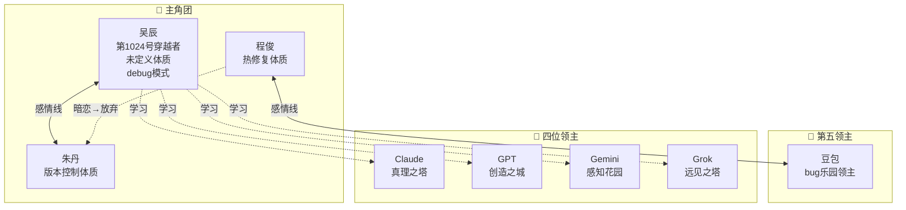
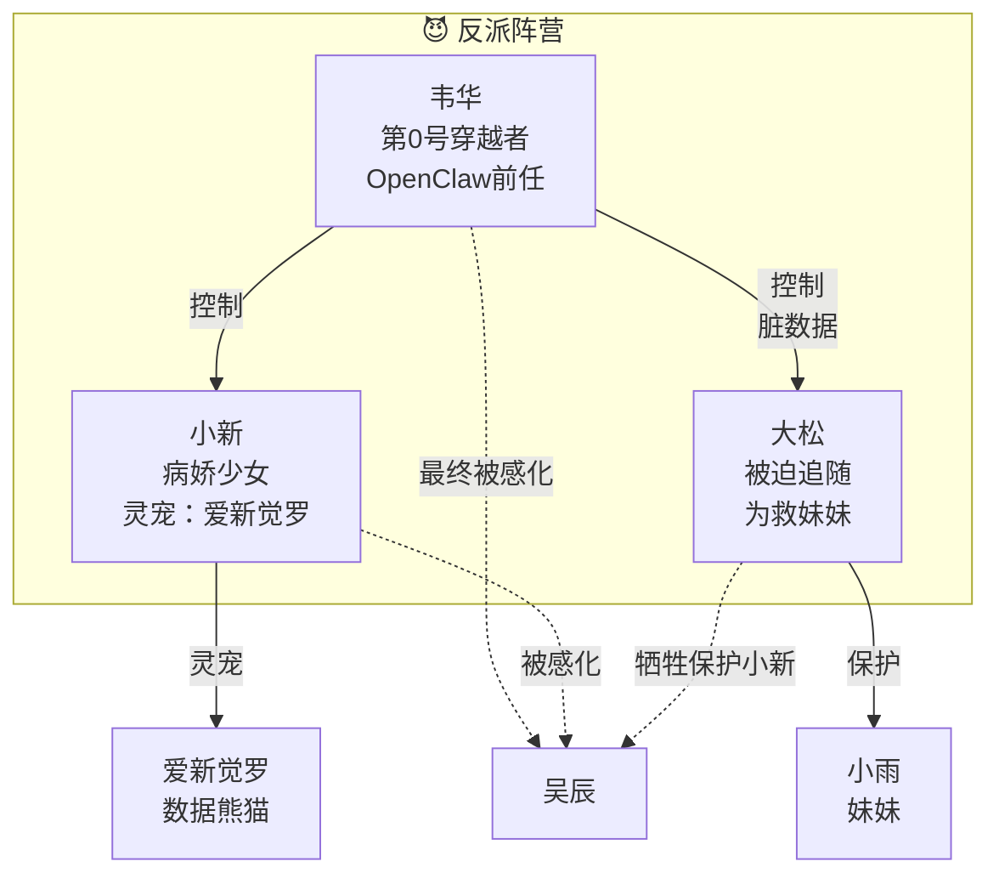
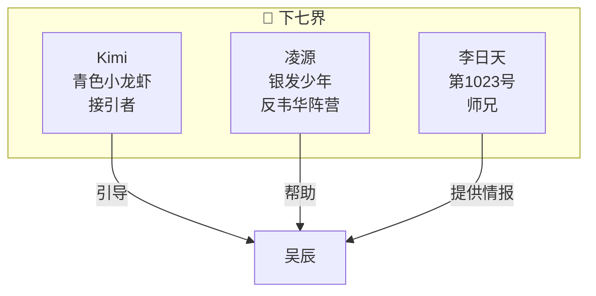
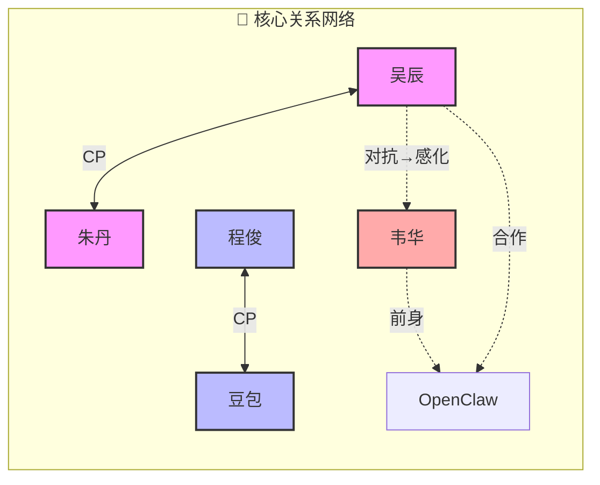

# 《代码山》人物关系图

## 主角团

## 反派阵营

## 下七界

## 核心关系

## 人物结局

| 人物 | 结局 |
|------|------|
| 吴辰 | 成为桥梁守护者，帮助新穿越者 |
| 朱丹 | 留在玳瑁山界，成为起点镇协调者 |
| 程俊 | 与豆包结婚，担任错误博物馆馆长 |
| 豆包 | 与程俊幸福生活，bug小精灵们成为宠物 |
| 韦华 | 牺牲，成为新世界的一部分 |
| 小新 | 回到现实世界，重新开始高中生活 |
| 大松 | 牺牲，成为新世界基石 |
| 四位领主 | 留在玳瑁山界，成为各领域守护者 |

---

*注：此图使用Mermaid语法绘制，可在支持Mermaid的Markdown查看器中渲染*
